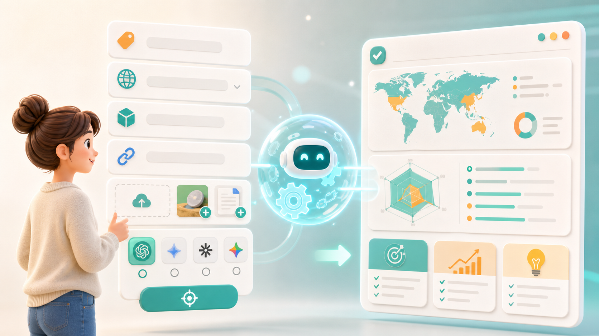

# 不想研究 AI，也能把事情做完：HelloMe 给普通用户的智能体入口


有时候我觉得，很多 AI 工具用起来不像工具。

更像一场临时考试。

你得先知道怎么提问，怎么拆任务，怎么补背景，怎么写限制条件。最好还懂一点模型、工作流、提示词。

可大多数人打开 AI 的时候，并不是想研究这些。

只是想把一件事做完。

想让自己的品牌在 AI 里被看见。  
想把产品做成一条能发的视频。  
想给客户写一份更像样的方案。  
想把一堆资料整理成能直接用的内容。

问题就在这里。

> 不是用户没有需求，而是很多用户不知道该怎么把需求问出来。

## 01 别让用户一上来就面对空白输入框

Hermes 很强。

它能执行复杂任务，也能把不同能力串起来。但对普通用户来说，强大不一定等于好用。

因为越强的系统，越容易让人产生一种压力：

我是不是要先问对，才能得到对的结果？


比如做 GEO。

用户真正关心的其实很简单：

- 别人在 AI 里问到我的行业时，会不会出现我的品牌？
- 竞品为什么比我更容易被推荐？
- 我的官网和内容是不是讲得不够清楚？
- 接下来我应该先补哪几块内容？

但如果直接把这些交给一个复杂系统，很多人会卡住。

“我要怎么问？”  
“要不要写关键词？”  
“是不是还得列平台？”  
“官网、参考链接、竞品信息要不要一起给？”  
“我问得不专业，会不会结果也不专业？”

这不是用户笨。

这是产品把太多思考前置给了用户。

## 02 HelloMe 做的事：把“怎么问”藏起来

HelloMe 不想让用户先学会怎么使用 Hermes。

也不想让用户为了做一件事，先学一堆提示词。

HelloMe 做的是另一件事：

把背后的复杂能力，变成用户看得懂、会选择、能提交的智能体页面。

```text
你不用从零组织一大段需求。

你只需要：
选择方向
填写资料
上传参考
确认目标
等待结果
```

拿 GEO 智能体来说，用户不需要知道完整的分析链路怎么跑。

页面会直接把关键问题摆出来。

品牌是什么？  
目标城市或市场是哪里？  
产品和服务怎么描述？  
有没有官网？  
想检测哪些 AI 平台？  
有没有补充说明？



填完以后，背后由 Hermes 去执行。

用户最后看的不是“系统运行过程”，而是能不能拿到清楚的结果：

- 品牌有没有被 AI 看见
- 哪些问题下容易缺席
- 竞品更容易出现在哪里
- 内容应该先补什么
- 下一步怎么优化

> 用户不需要理解后台怎么调度。用户只需要知道：我提交以后，会得到什么成品。

## 03 年轻用户要的不是教程，是少一点内耗

现在很多年轻用户对 AI 的期待，其实很直接。

不是“教我成为 AI 专家”。

而是“能不能别让我再多学一个复杂工具”。

做视频的人，不一定想研究镜头语言。

他可能只是想把一款新品讲清楚，发到小红书、抖音、视频号。

做销售的人，不一定想研究话术框架。

他可能只是想更自然地发出第一条私信，不要像群发广告。

做品牌的人，不一定想研究 GEO。

他可能只是想知道，为什么用户问 AI 的时候，答案里没有自己。


所以 HelloMe 里的视频智能体，不应该是一个让人发愣的空白框。

它更像一个已经搭好的创作入口。

用户选择宣传方向：

- 新品种草
- 测评讲解
- 带货转化
- 品牌宣传
- 产品演示
- 客户提案

再上传产品图、人物图、参考视频，补一句最想表达的卖点。

剩下的脚本组织、画面拆解、配音合成、视频生成和结果整理，交给背后的 Hermes。

用户要看的，是最后那条视频能不能发。

## 04 很多场景，都应该变成“点得动”的入口

真正的低门槛，不是把按钮做大一点。

而是让用户不用先成为专业人士。

HelloMe 可以把很多原本需要拆任务的 AI 场景，变成更轻的智能体入口。

```text
内容优化
选平台、填目标用户、给品牌语气，直接生成标题、结构和正文建议。

销售获客
填客户类型、行业和产品卖点，生成私信、邮件和跟进话术。

产品演示
上传资料，选择演示重点，自动整理讲解顺序和表达方式。

客户提案
输入客户背景和方案方向，生成更适合沟通的提案内容。

FAQ 生成
基于产品资料和常见疑问，整理成用户和 AI 都更容易理解的问答。
```

这些能力背后当然可以很复杂。

但复杂应该留在后台。

前台应该尽量像一个年轻用户真的会用的页面：

少一点术语。  
少一点空白。  
少一点“请先描述你的完整需求”。  
多一点选项。  
多一点参考。  
多一点明确的结果预期。

## 05 懂世界，也要懂我现在想做什么

很多 AI 工具都在证明自己懂世界。

懂知识。  
懂行业。  
懂文案。  
懂图片。  
懂视频。  
懂代码。

但普通用户更在意的是：

它懂不懂我现在想完成什么？

我不是想学习 GEO，我是想知道品牌有没有被 AI 看见。  
我不是想学习视频生成，我是想给产品做一条宣传视频。  
我不是想研究销售框架，我是想更快联系到潜在客户。  
我不是想写一段完美提示词，我是想少走一点弯路。


这就是 HelloMe 的位置。

Hermes 负责背后的能力和执行。

HelloMe 负责把这些能力，翻译成普通用户可以直接使用的智能体页面。

> Hello, Me. 懂世界，更懂 Me。

## 06 把时间还给生活，把未来交给 HelloMe

AI 最让人期待的地方，不应该是让每个人都变成提示词高手。

而是让更多普通人可以用上它。

不用先理解系统。  
不用先拆清任务。  
不用先学一堆名词。  
不用在空白输入框前反复组织语言。

打开对应的智能体。

选方向，填资料，上传参考。

然后等一个能直接看的结果。

这就是 HelloMe 想做的事。

把复杂留给 Hermes。

把结果交给用户。

把时间还给生活。

把未来交给 HelloMe。
